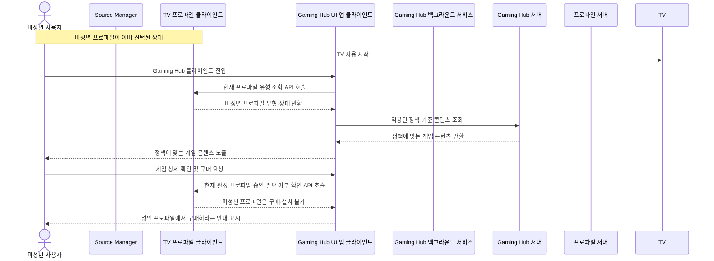
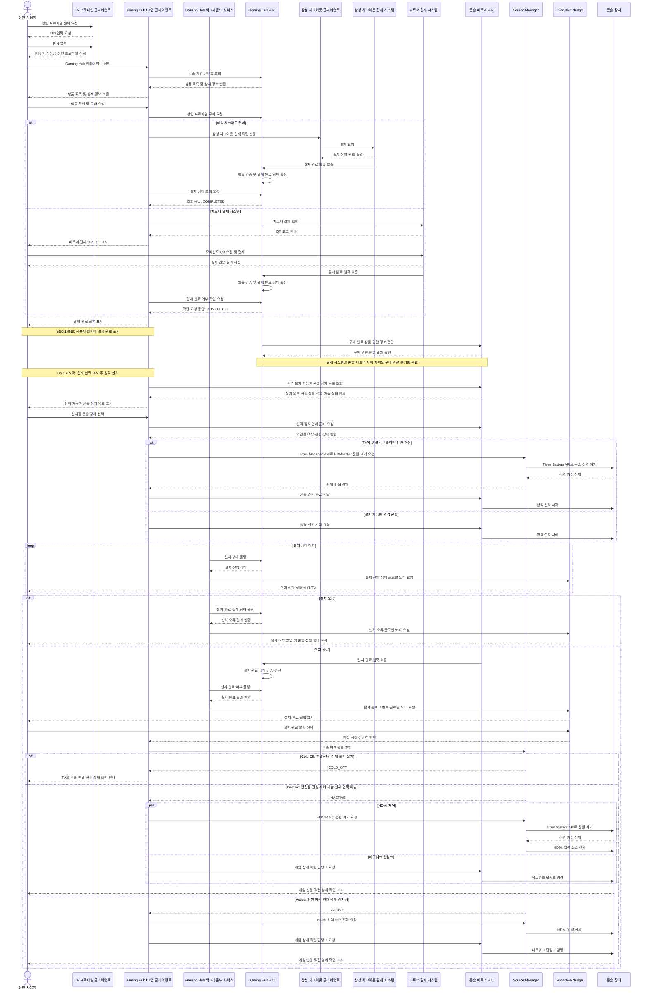
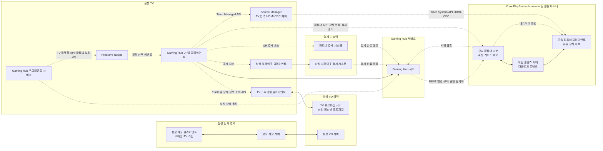
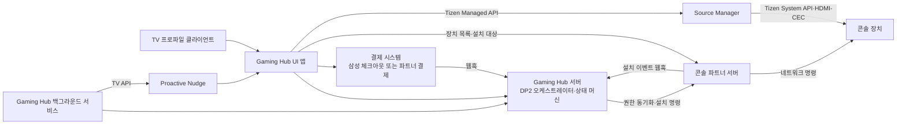
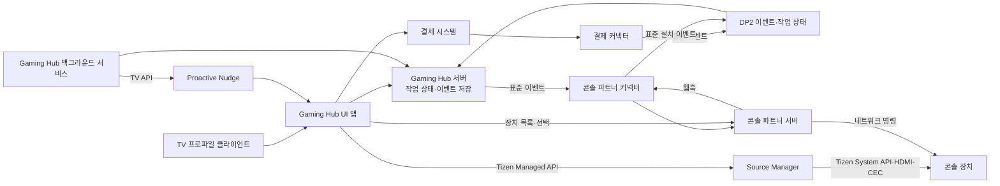

# Gaming Hub DP2 아키텍처 설계

> 상태: 초안 템플릿
>
> 목적: 삼성 계정과 TV 프로파일을 기반으로 콘솔 상품 구매부터 원격 설치, 설치 완료 알림, 콘솔 딥링크까지의 서비스 아키텍처를 설계하고 비교한다.

## 1. 배경

Gaming Hub는 Xbox, PlayStation, Nintendo 등 콘솔 파트너의 콘텐츠를 TV에서 탐색하고 이용할 수 있는 경험을 제공한다.

콘솔 파트너 콘텐츠의 기본 데이터 흐름과 콘텐츠 종류별 처리 방식은 Decision Point 1(DP1)에서 다룬 것으로 전제한다. 이 문서는 Decision Point 2(DP2)에 해당하는 사용자 프로파일 기반 구매·설치·실행 경험을 다룬다.

## 2. 목표

- 삼성 계정과 TV 프로파일을 구분해 사용자별 경험을 제공한다.
- 성인 및 미성년 프로파일의 권한과 구매 가능 범위를 반영한다.
- 콘솔 파트너 상품을 노출하고 결제 결과를 신뢰성 있게 확인한다.
- 사용자가 설치 대상 콘솔 장치를 선택할 수 있도록 한다.
- 선택한 콘솔의 연결 상태와 설치 가능 상태를 확인한다.
- 원격 설치를 시작하고 설치 상태 및 완료 결과를 Gaming Hub 클라이언트에 전달한다.
- 설치 완료 후 HDMI-CEC 및 네트워크 명령을 활용해 콘솔과 게임 상세 화면으로 이동한다.
- 사용자가 TV를 시청 중이거나 이미 콘솔을 사용 중인 경우에도 안전하게 상태를 안내한다.

## 3. 주요 개념

| 개념 | 설명 |
|---|---|
| 삼성 계정 | TV와 서비스의 상위 사용자 계정 |
| TV 프로파일 | 하나의 삼성 계정 안에서 개인화된 설정과 권한을 제공하는 사용자 단위 |
| 미성년 프로파일 | 별도 PIN 없이 선택할 수 있으며, 연령·보호자 정책에 따라 상품 노출·구매·설치가 제한되는 프로파일 |
| 성인 프로파일 | TV에 적용하기 전에 PIN 인증이 필요한 프로파일 |
| Gaming Hub UI 앱 클라이언트 | TV에서 콘텐츠를 탐색하고 구매·설치·실행 상태를 사용자에게 보여주는 화면 앱 |
| Gaming Hub 백그라운드 서비스 | 설치 완료 상태를 Gaming Hub 서버에 폴링하고 Proactive Nudge를 호출하는 백그라운드 구성요소 |
| 콘솔 파트너 | Xbox, PlayStation, Nintendo 등 콘텐츠와 원격 기능을 제공하는 외부 파트너 |
| 원격 설치 서버 | 사용자가 선택한 콘솔 장치에 설치 요청을 전달하고 상태를 추적하는 서버 |
| 딥링크 | 콘솔의 특정 게임 또는 실행 직전 상세 화면까지 이동시키는 기능 |

## 4. 핵심 사용자 흐름

1. 사용자가 TV 프로파일로 Gaming Hub에 진입한다.
2. 프로파일 권한과 지역·연령 조건에 따라 콘솔 상품을 조회한다.
3. 사용자가 상품을 선택하고 결제를 진행한다.
4. 결제 시스템의 결과를 Gaming Hub 서버가 검증하고 주문 상태를 확정한다.
5. 사용자가 설치 대상 콘솔 장치를 선택한다.
6. Gaming Hub 서버가 콘솔 연동 상태와 설치 가능 여부를 확인한다.
7. 원격 설치 서버에 설치 요청을 전달한다.
8. 설치 진행·성공·실패 상태를 추적한다.
9. 설치 완료 결과를 Gaming Hub 클라이언트에 전달한다.
10. 사용자의 현재 TV·HDMI·콘솔 상태에 따라 알림, 입력 전환, 딥링크를 수행한다.

### 4.1 사용자 시나리오 A: 미성년 프로파일의 구매·원격 설치 차단

1차 정책에서는 Netflix Kids와 Amazon Prime Video Kids와 같이 미성년 프로파일의 구매와 원격 설치를 허용하지 않는다. 미성년 사용자는 허용된 게임 콘텐츠를 탐색할 수 있지만, 결제와 설치를 진행하려면 성인 프로파일로 전환해야 한다.

1. 미성년 프로파일이 이미 선택된 상태에서 미성년 사용자가 TV 사용을 시작한다. 미성년 프로파일 선택에는 별도 PIN을 요구하지 않는다.
2. 사용자가 Gaming Hub 클라이언트에 진입한다.
3. Gaming Hub 클라이언트가 TV 프로파일 클라이언트가 제공하는 현재 프로파일 유형 조회 API를 호출한다.
4. TV 프로파일 클라이언트가 현재 프로파일이 미성년임을 반환한다.
5. Gaming Hub 클라이언트가 미성년 프로파일 정책을 적용하고 허용된 콘솔 게임 콘텐츠를 표시한다.
6. 사용자가 게임 상세 정보를 확인하고 구매를 시도한다.
7. Gaming Hub 클라이언트가 구매를 차단하고 “성인 프로파일에서 구매하세요” 안내를 표시한다.
8. 결제, 콘솔 장치 선택, 원격 설치, 딥링크 단계로는 진행하지 않는다.



### 4.2 사용자 시나리오 B: 성인 프로파일의 구매 및 원격 설치

성인 프로파일은 해당 지역과 계정 정책이 허용하는 범위에서 게임 콘텐츠를 탐색하고 구매한 뒤, 연결된 콘솔 장치에 원격 설치를 요청한다.

1. 성인 프로파일을 TV에 적용하려면 사용자가 PIN을 입력한다.
2. PIN 인증이 성공하면 성인 프로파일이 선택된 상태가 되고 사용자가 TV 사용을 시작한다.
3. 사용자가 Gaming Hub 클라이언트에 진입한다.
4. Gaming Hub 클라이언트가 성인 프로파일에 허용된 콘솔 게임 콘텐츠를 노출한다.
5. 사용자가 게임 상세 정보와 가격을 확인하고 구매를 요청한다.
6. Gaming Hub 서버가 결제 요청을 생성한다.
7. 결제 시스템이 결제를 처리하고 Gaming Hub 서버에 결제 완료 웹훅을 호출한다.
8. Gaming Hub 서버가 웹훅을 검증하고 최종 결제 완료 상태를 확정한다.
9. Gaming Hub 서버가 Gaming Hub 클라이언트에 최종 결제 완료 결과를 전달한다.
10. Gaming Hub 클라이언트가 성인 사용자에게 결제 완료 화면을 표시한다.
11. 결제 완료 표시가 끝난 뒤 Step 2 원격 설치를 시작한다.
12. 사용자가 설치할 콘솔 장치를 선택한다.
13. 파트너 서버가 콘솔 장치의 연결 상태와 설치 가능 여부를 확인한다.
14. 원격 설치 서버를 통해 선택한 콘솔에 설치를 요청한다.
15. 설치 상태와 완료 결과를 Gaming Hub 클라이언트에 전달한다.
16. 설치가 완료되면 사용자에게 알리고, 사용자의 현재 TV 상태에 따라 콘솔 입력 전환과 딥링크를 수행한다.



## 5. 기술적 어려움과 미결정 사항

- 삼성 계정, TV 프로파일, 파트너 계정, 콘솔 장치 식별자의 매핑 방식
- 미성년 프로파일의 상품 노출·결제·설치 권한 정책
- 삼성 Checkout과 파트너 스토어 결제 중 어떤 결제 주체를 선택할지
- 결제 성공을 검증하기 위한 서버 간 이벤트·콜백·조회 방식
- 중복 결제 및 중복 설치 요청을 방지하는 멱등성 처리
- 콘솔 장치가 해당 TV에 연결되어 있는지 판별하는 기준
- 콘솔이 꺼져 있거나 네트워크 연결이 끊긴 경우의 처리
- 파트너별 원격 설치 API와 상태 모델의 차이를 공통 모델로 추상화하는 방법
- HDMI-CEC 제어와 네트워크 명령의 책임 분리 및 실패 처리
- 사용자가 TV 시청 중이거나 콘솔을 이미 사용 중일 때의 입력 전환 정책
- 설치 완료 후 UI 앱이 종료된 상태에서도 TV 백그라운드 서비스가 동작할 수 있는지와 운영 제약
- 백그라운드 서비스의 폴링 주기, 중복 폴링 방지, 배터리·리소스·네트워크 비용
- Proactive Nudge 호출 권한과 알림 선택 이벤트를 UI 앱으로 전달하는 TV 플랫폼 계약
- 결제 완료 후 콘솔 파트너 서버에 상품 권한을 동기화하는 API와 실패 시 재처리 정책
- 삼성 체크아웃·파트너 결제별 결제 식별자와 콘솔 파트너 상품 식별자의 매핑
- Cold Off·Inactive·Active 상태 판별의 정확한 주체와 Tizen API가 제공하는 상태 범위
- 설치 완료 후 HDMI 입력 전환과 네트워크 딥링크의 순서·병렬 처리 및 타임아웃
- 설치 완료 이벤트의 지연·중복·순서 뒤바뀜 처리
- 개인정보, 결제 정보, 미성년자 보호를 포함한 보안 및 감사 추적

## 6. DP2 통신 및 비동기 오케스트레이션 구조

DP2의 원격 설치는 사용자가 화면을 떠난 뒤에도 20~30분 이상 진행될 수 있는 장시간 작업이다. 따라서 Gaming Hub 서버가 설치 작업의 상태를 보관하고 조정하는 비동기 오케스트레이터 역할을 담당한다. 클라이언트가 설치 화면을 계속 유지하거나 설치 완료를 기다리며 동기 호출을 붙잡지 않는다.

### 6.1 모듈별 통신 방식

| 통신 경계 | 권장 방식 | 주요 용도 |
|---|---|---|
| Gaming Hub 서버 ↔ 콘솔 파트너 서버 | HTTPS REST API | 원격 설치 시작, 딥링크 요청, 작업 명령 |
| 콘솔 파트너 서버 → Gaming Hub 서버 | 서명된 HTTPS 웹훅 | 설치 시작·진행·완료·실패 이벤트 전달 |
| Gaming Hub UI 앱 클라이언트 ↔ 콘솔 파트너 서버 | 파트너 공식 HTTPS API | 파트너 계정에 연결된 장치 목록 조회와 장치 선택 |
| Gaming Hub UI 앱 클라이언트 ↔ TV 프로파일 클라이언트 | TV 프로파일 클라이언트 API | 현재 프로파일 상태 조회와 구매 정책 확인 |
| Gaming Hub 백그라운드 서비스 → Gaming Hub 서버 | HTTPS 상태 조회 API | 화면이 보이지 않는 동안 설치 상태 폴링 |
| Gaming Hub 백그라운드 서비스 → Proactive Nudge | TV 플랫폼 API | 설치 진행·완료·실패 글로벌 노티 요청 |
| Gaming Hub UI 앱 클라이언트 ↔ Source Manager | Tizen Managed API | HDMI-CEC 전원 제어, 입력 소스 전환, 현재 연결 상태 확인 |
| Source Manager ↔ 콘솔 | Tizen System API | 플랫폼이 제공하는 콘솔 연동과 HDMI 입력 제어 |
| 콘솔 파트너 서버 ↔ 콘솔 클라이언트 | 파트너 네트워크 명령 | 원격 설치와 게임 상세 화면 딥링크 |

파트너 장치 정보는 파트너 서버에서 Gaming Hub 서버로 전달하지 않는다. Gaming Hub 클라이언트가 파트너 인증·API를 통해 장치 목록을 직접 조회하고, Gaming Hub 서버에는 장치 개인정보나 파트너 장치 식별자를 저장하지 않는 것을 기본 원칙으로 한다.

### 6.2 설치 작업 오케스트레이션

1. 결제가 최종 완료되고 콘솔 파트너 서버에 구매 권한이 반영되면 Gaming Hub 서버가 설치 작업과 사용자의 자동 실행 의도를 저장한다.
2. Gaming Hub UI 앱 클라이언트가 파트너 서버에서 원격 설치 가능한 장치 목록을 직접 조회한다.
3. 사용자가 장치를 선택하면 Gaming Hub UI 앱 클라이언트가 파트너 서버에 설치 준비를 요청한다.
4. 파트너가 장치 상태를 반환하고, 선택한 장치가 현재 TV에 연결된 콘솔인지 확인한다.
5. 연결된 콘솔의 전원이 꺼져 있으면 Gaming Hub UI 앱 클라이언트가 Tizen Managed API를 통해 Source Manager에 HDMI-CEC 전원 켜기를 요청한다.
6. Source Manager가 전원 켜짐 결과를 반환하고, Gaming Hub UI 앱 클라이언트가 그 결과를 파트너 서버에 전달한다.
7. Gaming Hub UI 앱 클라이언트가 파트너 서버에 원격 설치 시작을 요청하고, 설치 요청 접수 화면을 표시한다.
8. 파트너 서버가 설치를 수행하고 Gaming Hub 서버의 웹훅으로 상태 이벤트를 전달한다.
9. Gaming Hub 서버가 이벤트를 검증하고 설치 상태를 갱신한다.
10. Gaming Hub 백그라운드 서비스가 폴링으로 설치 완료를 확인하고 Proactive Nudge에 글로벌 노티를 요청한다.
11. 사용자가 완료 노티를 선택하면 Gaming Hub UI 앱 클라이언트가 Source Manager에 상태를 조회한다.
12. Cold Off·Inactive·Active 상태에 따라 전원 켜기와 입력 전환을 수행하고, 가능한 경우 파트너 서버에 딥링크를 요청한다.

### 6.3 설치 상태 모델

설치 작업은 서버에 다음과 같은 상태로 저장한다.

`INSTALL_REQUESTED → DEVICE_CHECKING → DEVICE_WAKEUP_REQUIRED → DEVICE_READY → INSTALLING → COMPLETED`

예외 상태는 다음과 같이 분리한다.

`DEVICE_UNAVAILABLE`, `WAKEUP_FAILED`, `INSTALL_FAILED`, `DEEPLINK_FAILED`, `EXPIRED`

결제 완료 상태와 설치 상태는 별도로 관리한다. 설치 실패는 자동 결제 환불을 의미하지 않으며, 환불은 별도의 결제·고객지원 정책 흐름으로 처리한다.

### 6.4 이벤트 및 보안 원칙

- 파트너 서버와 Gaming Hub 서버 사이의 명령은 HTTPS REST API로 전달한다.
- 파트너 서버가 보내는 설치 이벤트는 서명된 웹훅으로 받고, Gaming Hub 서버에서 서명을 검증한다.
- 설치 요청과 이벤트에는 작업 ID, 이벤트 ID, correlation ID를 사용한다.
- 동일한 웹훅이 여러 번 도착해도 한 번만 상태를 전이시키도록 멱등성을 보장한다.
- 웹훅은 빠르게 `2xx`로 수신 확인을 반환하고, 실제 상태 처리는 비동기로 수행한다.
- Gaming Hub UI 앱이 화면에 보이지 않는 동안에도 Gaming Hub 백그라운드 서비스가 서버 상태를 폴링한다. Source Manager 호출은 UI 앱이 Tizen Managed API를 통해 수행한다.
- Gaming Hub 서버는 Proactive Nudge를 직접 호출하지 않는다. 백그라운드 서비스가 TV 플랫폼 API를 통해 Proactive Nudge를 호출한다.
- 설치 완료 후 자동 입력 전환과 딥링크는 사용자의 사전 선택 또는 동의를 전제로 한다.
- 장치 목록과 파트너 계정 정보는 Gaming Hub 서버에 저장하지 않고, 클라이언트와 파트너 사이에서 최소 범위로 처리한다.

## 7. 시스템 모듈 및 관계

다음 관계도는 DP2에서 고려하는 주요 모듈의 경계를 나타낸다. 삼성 계정은 모바일·TV·가전 등 전사 서비스에서 공유되는 계정이며, TV 프로파일은 TV 프로파일 클라이언트와 프로파일 서버 범위에서만 관리되는 별도 개념이다.

콘솔 파트너 서버는 파트너 계정·서비스 제어 영역과 실제 게임 콘텐츠 다운로드 영역으로 나누어 표현한다. 콘솔 파트너 클라이언트는 실제 콘솔 장치 내부에서 동작하는 소프트웨어다. 딥링크는 별도 모듈이 아니라 Gaming Hub UI 앱 클라이언트와 콘솔 파트너 클라이언트 사이에서 수행되는 기능이다.



## 8. 품질 속성

설계안 1과 2를 비교하기 전에, 두 설계안이 공통으로 만족해야 하는 품질 속성을 먼저 정의한다. 품질 속성 명칭은 ISO/IEC 25010:2023 제품 품질 모델의 특성명을 기준으로 사용한다. 해당 모델은 소프트웨어·ICT 제품의 품질을 9개 특성으로 정의하며, 여기서는 DP2와 직접 관련된 6개를 후보로 선정한다. ([ISO/IEC 25010:2023](https://www.iso.org/standard/78176.html))

### 8.1 이번 DP의 확정 품질 속성 3개

| 번호 | 품질 속성 | 상황 | 기대 결과 | 우선순위 후보 |
|---|---|---|---|---|
| QA-1 | 신뢰성 (Reliability) | 결제·설치 웹훅이 중복·지연·순서 변경으로 도착함 | 상태가 중복 처리되거나 잘못 전이되지 않고, 장애 후에도 작업을 복구함 | **확정** |
| QA-2 | 호환성 — 상호운용성 중심 (Compatibility — Interoperability) | 삼성 TV 플랫폼, 삼성 체크아웃·파트너 결제 시스템, 콘솔 파트너 시스템의 API·상태값·데이터 형식이 서로 다름 | 각 시스템의 계약 차이를 정확히 변환하고 공통 결제·권한·원격 설치 흐름으로 연결함 | **확정** |
| QA-3 | 상호작용 능력 (Interaction Capability) | 사용자가 설치 중 다른 TV 콘텐츠를 보고 있다가 Proactive Nudge를 선택함 | 상태를 이해하고 필요한 입력 전환·전원 제어·딥링크를 예측 가능하게 수행함 | **확정** |

### 8.2 우선순위 결정 기준

- ISO/IEC 25010 특성의 적용 범위와 DP2 시나리오의 추적 가능성
- 결제 완료 후 중복 설치나 잘못된 구매 권한이 발생할 위험
- 미성년 프로파일과 파트너 장치 정보의 보호 수준
- 삼성 TV·결제 시스템·콘솔 파트너 간 계약과 API 차이
- TV 시청 중 완료 알림과 콘솔 전환 경험
- 새로운 콘솔 파트너 추가와 장애 복구에 필요한 변경 범위

### 8.3 1차 핵심 품질 속성 후보

현재까지의 기술적 어려움과 확정된 QA 시나리오를 기준으로 이번 DP에서 비교·측정할 품질 속성은 다음 세 가지로 확정한다.

1. **신뢰성 (Reliability)**: 결제·구매 권한·설치 상태를 정확히 연결하고 중복·지연 이벤트와 장애를 안전하게 처리하는 능력
2. **호환성 — 상호운용성 중심 (Compatibility — Interoperability)**: 서로 다른 결제·콘솔 파트너의 계약·API·상태값을 정확히 변환하고 연결하는 능력
3. **상호작용 능력 (Interaction Capability)**: 설치·전원·소스·딥링크 상태를 사용자에게 이해 가능하게 안내하고 다음 행동으로 연결하는 능력

보안, 성능 효율성, 유지보수성·유연성은 이번 DP의 확정 품질 속성에서 제외한다. 가용성과 복구성은 QA-1 신뢰성의 하위 측정 관점으로만 다룬다.

### 8.4 QA-1 신뢰성 시나리오 — 확정

QA-1은 DP2 설계안 비교에 사용할 첫 번째 품질 속성으로 확정한다. 이 시나리오는 사용자의 결제 의사나 결제 전환율이 아니라, **결제가 최종 완료된 이후 웹훅이 TV와 다음 단계까지 정확히 연결되는지**를 측정한다.

| 시나리오 요소 | 정의 |
|---|---|
| 자극원 (Source) | 삼성 체크아웃 서버 또는 파트너 결제 시스템 |
| 자극 (Stimulus) | 최종 결제 완료 이벤트를 Gaming Hub 서버의 웹훅으로 전달한다. 웹훅은 지연·중복·순서 변경 또는 일시적 오류 상태로 도착할 수 있다. |
| 환경 (Environment) | 정상 운영 중인 상태. Gaming Hub UI 앱이 화면에 없을 수 있으며, Gaming Hub 백그라운드 서비스가 서버 상태를 조회한다. |
| 대상 (Artifact) | Gaming Hub 서버의 결제 상태·권한 동기화·Step 2 전이와 TV 클라이언트 반영 경로 |
| 응답 (Response) | 웹훅을 검증하고 멱등적으로 처리한 뒤 결제 상태를 `COMPLETED`로 저장한다. Gaming Hub 클라이언트가 상태 조회로 완료 결과를 받고 TV에 반영한 후, 콘솔 파트너 권한 동기화와 Step 2 원격 설치로 정확히 전이한다. |
| 응답 측정값 (Response Measure) | 최종 결제 완료 건수 대비 위 응답을 모두 충족한 건수의 비율. 웹훅 미수신, 상태 불일치, 중복 부작용, TV 미반영, Step 2 미전이는 실패로 측정한다. |

#### 측정식

```text
결제 완료 후속 처리 신뢰성(%)
= (TV 반영 및 Step 2 전이까지 성공한 건수
   / 최종 결제 완료 건수) × 100
```

동일 웹훅이 여러 번 도착하더라도 한 번만 상태·권한을 반영하고 나머지를 안전하게 무시하면 성공으로 본다. 반대로 결제는 완료됐지만 웹훅이 유실되거나, 서버에는 완료로 저장됐는데 TV 또는 Step 2에 반영되지 않으면 실패로 본다. 사용자의 결제 취소·이탈·결제수단 미등록은 최종 결제 완료 건수가 아니므로 이 QA-1의 분모에 포함하지 않는다.

초기 비교 등급은 다음과 같이 사용한다. 수치는 국제 표준값이 아니라 DP2 설계안 비교를 위한 목표 기준이며, 운영 데이터 확보 후 조정한다.

| 등급 | 결제 완료 후속 처리 신뢰성 |
|---|---:|
| 우수 | 99.9% 이상 |
| 보통 | 99.0% 이상 ~ 99.9% 미만 |
| 미흡 | 99.0% 미만 |

#### 수치 기준의 근거와 해석

이 등급은 임의로 “99.9%가 항상 우수”하다고 주장하는 기준이 아니다. 공개된 SRE·클라우드 운영 자료에서 사용되는 SLO와 오류 예산을 참고해, DP2의 **결제 완료 후속 처리**에 적용한 초기 목표선이다.

- Google SRE는 SLI를 좋은 결과의 비율로 정의하고, 99.9% SLO를 0.1% 오류 예산으로 설명한다. 300만 건을 기준으로 하면 허용 오류는 3,000건이다. ([Google SRE Workbook](https://sre.google/workbook/implementing-slos/))
- Google Cloud는 가용성 예시로 99.9%를 단일 영역, 99.99%를 다중 영역, 99.999%를 다중 리전 수준으로 제시한다. 30일 기준으로 99.9%는 약 43.2분의 장애 허용량이다. ([Google Cloud Architecture Center](https://docs.cloud.google.com/architecture/infra-reliability-guide/building-blocks))
- AWS Well-Architected는 일반적인 설계 목표 예시로 99%를 배치 처리, 99.9%를 내부 도구, 99.95%를 온라인 상거래·POS 범주에 제시한다. 따라서 결제 완료 후속 처리에서 99.9%는 최소 목표선으로 볼 수 있지만, 결제·상거래 수준의 엄격한 목표로는 99.95% 이상도 검토해야 한다. ([AWS Reliability Pillar](https://docs.aws.amazon.com/pdfs/wellarchitected/latest/reliability-pillar/reliability-pillar.pdf))
- Google SRE의 SLO 조사에서는 실제 조직들이 99%, 99.9%, 90%를 SLO 목표로 사용한 사례가 보고된다. 이는 해당 숫자가 실제 운영에서 쓰인다는 근거이지, 세 수치가 동일한 품질 등급이라는 뜻은 아니다. ([SLO Adoption and Usage in SRE](https://sre.google/static/pdf/SloAdoptionAndUsageInSre.pdf))

따라서 DP2의 해석은 다음과 같이 고정한다.

| 구간 | DP2 해석 | 근거에 따른 의미 |
|---|---|---|
| 99.9% 이상 | 우수·목표 달성 | 0.1% 이하의 후속 처리 오류 예산. 일반적인 고신뢰 서비스의 3-nines 수준이며, DP2의 1차 목표선이다. |
| 99.0% 이상 ~ 99.9% 미만 | 경계·개선 필요 | 1%까지 후속 처리 문제가 발생할 수 있어, 결제 완료 후 TV 반영이라는 핵심 흐름에는 위험 신호다. |
| 90.0% 이상 ~ 99.0% 미만 | 미흡 | 최대 10%의 완료 건이 TV 반영 또는 Step 2 전이에 실패할 수 있으므로 운영 기준으로 부적절하다. |
| 90.0% 미만 | 심각한 실패 | 완료된 결제 10건 중 1건 이상이 후속 처리되지 않는 수준이다. |

AWS 자료가 온라인 상거래의 예시 목표로 99.95%를 제시하므로, 향후 실제 운영 데이터가 확보되면 99.9%를 “우수”가 아닌 “최소 목표”, 99.95% 이상을 “상위 목표”로 세분화할 수 있다. 현재 설계안 비교에서는 우선 99.9%·99.0%·90.0%의 세 구간을 사용하되, 90%는 중간 등급이 아니라 명확한 미흡·심각 실패 경계로 해석한다.

#### 근거 출처

- [AWS Well-Architected Framework — Reliability Pillar](https://docs.aws.amazon.com/pdfs/wellarchitected/latest/reliability-pillar/reliability-pillar.pdf): 가용성 설계 목표 예시에서 온라인 상거래·POS를 99.95% 수준으로 제시한다. 이 자료는 결제 성공률의 공식 표준이 아니라, DP2의 결제 완료 후속 처리 신뢰성 목표를 설정하기 위한 외부 참고 근거로 사용한다.

### 8.5 QA-2 상호운용성 시나리오 — 확정

QA-2는 사용자의 결제 전환율이나 실제 거래 성공률이 아니라, 서로 다른 외부 시스템의 계약을 Gaming Hub가 정확히 해석·변환·연결하는 능력을 평가한다.

| 시나리오 요소 | 정의 |
|---|---|
| 자극원 (Source) | 삼성 체크아웃, 파트너 결제 시스템, Xbox·PlayStation·Nintendo 등 콘솔 파트너 시스템 |
| 자극 (Stimulus) | 각 시스템이 서로 다른 필드명·상태값·인증 방식·오류 형식으로 결제 완료·취소·실패·설치 상태 데이터를 전달한다. |
| 환경 (Environment) | 실제 모든 파트너와 동시에 연동하지 않는 검증 환경. 계약 테스트, Mock/Stub 서버, 파트너 샌드박스, 대표 파트너 인증을 조합한다. |
| 대상 (Artifact) | Gaming Hub의 파트너 어댑터, 상태값 변환, 웹훅 계약 검증, 권한 동기화·원격 설치 요청 변환 모듈 |
| 응답 (Response) | 외부 데이터를 내부 표준 모델로 정확히 변환하고, 파트너별 요구 형식으로 요청을 생성하며, 정상·실패·취소·중복·잘못된 데이터에 대해 정의된 결과를 반환한다. |
| 응답 측정값 (Response Measure) | 통과한 계약·변환·오류 처리 테스트 수를 전체 정의 테스트 수로 나눈 비율. 지원 대상 조합별 결과도 별도로 기록한다. |

#### QA-2 검증 방법과 측정식

실제 결제 시스템 전체를 연결하지 않아도 다음 네 단계로 검증한다.

1. 삼성 체크아웃과 파트너 결제 시스템의 샘플 웹훅으로 정상 완료·취소·실패·중복·지연·서명 오류·필드 누락 케이스를 계약 테스트한다.
2. 실제 파트너 서버 대신 Mock/Stub 서버를 사용해 Gaming Hub 서버의 요청·응답·상태 변환 흐름을 재현한다.
3. 파트너가 제공하는 샌드박스에서 테스트 결제·테스트 웹훅을 검증한다.
4. 실제 연동은 결제 시스템 1개와 콘솔 파트너 1개 등 대표 조합으로 인증하고, 나머지는 동일 계약 테스트로 검증한다.

```text
상호운용성 검증률(%)
= 통과한 계약·변환·오류 처리 테스트 수
  / 전체 정의 테스트 수
  × 100
```

사용자 결제 화면 진입 또는 결제 중도 이탈은 QA-2의 분모에 포함하지 않는다. QA-2는 거래 전환율이 아니라 시스템 간 계약 검증 결과를 측정하며, 삼성 체크아웃·파트너 결제·콘솔 파트너별 테스트 결과를 합산하지 않고 별도로 보고한다. 초기 목표는 정의된 지원 조합과 테스트 케이스의 100% 통과이며, 실패한 테스트는 해당 조합의 상호운용성 결함으로 기록한다.

### 8.6 QA-3 상호작용 능력 시나리오 — 확정

QA-3은 결제·원격 설치·콘솔 상태 변화가 진행되는 동안 사용자가 Gaming Hub UI 앱을 계속 보고 있지 않아도, Proactive Nudge를 통해 현재 상태와 필요한 다음 행동을 이해할 수 있는지를 평가한다. ISO/IEC 25010의 상호작용 능력과 ISO 9241-11의 사용성 관점인 효과성·효율성·만족도를 DP2의 글로벌 노티 및 소스 전환 시나리오에 적용한다.

#### 핵심 시나리오 테이블

| ID | 단계 | 상태·상황 | 필요한 사용자 상호작용 | 통과 조건 |
|---|---|---|---|---|
| IA-01 | 결제 | 결제 진행 중 | 결제 진행 또는 대기 상태 확인 | 현재 상태를 오해하지 않는 안내가 표시됨 |
| IA-02 | 결제 | 결제 완료 | 다음 단계 진입 확인 | 결제 완료가 표시되고 Step 2로 이어짐 |
| IA-03 | 결제 | 결제 실패·취소·시간 초과 | 원인 확인 및 재시도·종료 선택 | 실패 원인과 가능한 행동이 표시됨 |
| IA-04 | 설치 | 원격 설치 요청 직후 | 화면을 떠나도 되는지 확인 | 설치 시작과 백그라운드 진행 안내가 표시됨 |
| IA-05 | 설치 | 설치 진행 중 | 진행 상태 확인 | 설치 진행 또는 대기 상태가 표시됨 |
| IA-06 | 설치 | 설치 실패 | 오류 확인 및 후속 행동 선택 | 오류 알림과 재시도·종료·지원 안내가 표시됨 |
| IA-07 | 설치 | 설치 완료 | 완료 알림 선택 | 완료 알림에서 게임 실행 의도를 선택할 수 있음 |
| IA-08 | 콘솔 상태 | Cold Off | 콘솔 전원·연결 확인 | 전원 상태 확인 요청이 표시되고 딥링크를 보내지 않음 |
| IA-09 | 콘솔 상태 | Inactive | 콘솔 전원 켜기·입력 전환 진행 | 전원·입력 전환 과정과 실패 결과가 표시됨 |
| IA-10 | 콘솔 상태 | Active | 입력 전환·게임 실행 | 필요한 경우 입력을 전환하고 다음 단계로 진행함 |
| IA-11 | 소스 전환 | 전환 성공 | 결과 확인 | 선택한 콘솔 화면으로 전환되고 결과가 안내됨 |
| IA-12 | 소스 전환 | 전환 실패 | 재시도·취소 선택 | 실패 원인과 재시도·취소가 제공됨 |
| IA-13 | 딥링크 | 게임 화면 이동 성공·실패 | 게임 진입 또는 종료 선택 | 딥링크 결과가 표시되고 실패 시 대체 행동이 제공됨 |

#### QA-3 측정 방법과 별점 기준

각 시나리오는 다음 세 조건을 모두 만족할 때 통과로 기록한다.

1. 필요한 시점에 Proactive Nudge 또는 화면 안내가 표시된다.
2. 안내 내용이 실제 서버·콘솔 상태와 일치한다.
3. 사용자의 선택이 정의된 다음 동작으로 연결되며, 실패 시 재시도·취소·안내 중 하나가 제공된다.

```text
상호작용 시나리오 충족 수
= 위 세 조건을 모두 만족한 시나리오의 개수
```

| 별점 | 기준 | 해석 |
|---|---|---|
| ★★★ | 13개 시나리오 모두 통과하고 핵심 시나리오(IA-02·03·04·06·07·08·09·10·12·13)가 모두 통과 | 결제부터 설치·전원·소스 전환·딥링크까지 필요한 안내와 후속 행동을 모두 제공 |
| ★★☆ | 10~12개 시나리오 통과하고 핵심 시나리오 실패가 1개 이하 | 대부분의 상태를 안내하지만 일부 예외 상호작용이 누락 |
| ★☆☆ | 0~9개 시나리오 통과 또는 핵심 시나리오 실패가 2개 이상 | 사용자가 상태를 이해하거나 다음 행동을 수행하기 어려움 |

#### QA-3 근거 출처

- [ISO/IEC 25010:2023 — Product quality model](https://www.iso.org/standard/78176.html): 상호작용 능력(Interaction Capability)을 제품 품질 특성으로 정의하는 기준.
- [ISO 9241-11:2018 — Usability: Definitions and concepts](https://www.iso.org/standard/63500.html): 특정 사용자·목표·사용 맥락에서 효과성·효율성·만족도를 평가하는 근거.
- [ISO 9241-210:2019 — Human-centred design for interactive systems](https://www.iso.org/standard/77520.html): TV와 같은 소비자용 인터랙티브 시스템에 사용자 중심 설계와 평가를 적용하는 근거.

위 13개 시나리오와 별점 구간은 ISO가 정한 고정 수치가 아니라, 위 원칙을 DP2의 결제·설치·Proactive Nudge·소스 전환 흐름에 적용한 프로젝트 평가 기준이다.

## 9. 설계안

### 9.1 설계안 1: Gaming Hub 서버 중심 오케스트레이션

#### 개요

Gaming Hub 서버를 DP2의 단일 오케스트레이터로 두고, 결제 완료·권한 동기화·원격 설치 상태를 하나의 서버 상태 머신으로 관리한다. 서버는 결제 시스템의 웹훅을 수신하고 멱등 처리한 뒤 상태를 저장한다. UI 앱은 결제 완료 상태를 조회하고, 백그라운드 서비스는 설치 상태를 폴링한다. 장치 목록 조회와 설치 대상 선택은 기존 원칙대로 UI 앱이 파트너 서버를 직접 호출한다.

파트너 서버와 Gaming Hub 서버 사이에는 파트너별 REST API와 서명된 웹훅을 사용한다. Gaming Hub 서버 내부에는 삼성 체크아웃·파트너 결제·콘솔 파트너의 차이를 흡수하는 어댑터 계층을 둔다. TV 내부에서는 UI 앱이 Tizen Managed API로 Source Manager를 호출하고, Source Manager가 Tizen System API·HDMI-CEC를 사용한다.

#### Mermaid 다이어그램



#### 장점

- 결제·권한·설치 상태의 기준이 Gaming Hub 서버 한 곳에 있어 상태 추적과 복구가 단순하다.
- 웹훅 중복·지연·순서 변경을 하나의 멱등 상태 머신에서 처리하기 쉽다.
- UI 앱과 백그라운드 서비스의 책임이 분리되어 장시간 설치 중에도 화면을 점유하지 않는다.
- 두 결제 방식과 여러 콘솔 파트너를 공통 오케스트레이션으로 연결할 수 있다.

#### 단점

- Gaming Hub 서버가 파트너별 API·상태값·오류 모델을 많이 알아야 한다.
- 파트너가 추가되거나 계약이 변경될 때 중앙 서버 어댑터 변경과 회귀 검증이 필요하다.
- 중앙 오케스트레이터 장애가 여러 파트너 흐름에 동시에 영향을 줄 수 있다.

#### 트레이드오프

- 신뢰성과 운영 단순성을 높이는 대신, 파트너 확장성과 변경 격리에는 비용이 발생한다.
- 초기 DP2 범위와 소수의 파트너로 빠르게 검증하기에 적합하다.
- 파트너별 API 차이는 서버 내부의 `XboxAdapter`, `PlayStationAdapter`, `NintendoAdapter` 경계로 분리해, 외부 커넥터 서비스 없이도 변경 영향을 제한한다.

### 9.2 설계안 2: 파트너 커넥터·이벤트 기반 오케스트레이션

#### 개요

Gaming Hub 서버는 주문·프로파일·전체 작업의 상관관계와 사용자 상태만 관리하고, 파트너별 결제·권한·설치 계약은 독립된 커넥터가 담당한다. 커넥터는 파트너의 API·웹훅·상태값을 Gaming Hub 공통 이벤트로 변환한다. 오케스트레이션은 이벤트와 작업 상태를 기반으로 하는 Saga 형태로 구성한다.

결제 완료 후 Gaming Hub 서버가 공통 `PaymentCompleted` 이벤트를 발행하면, 콘솔 파트너 커넥터가 권한 동기화와 설치 요청으로 변환한다. 설치 진행·완료·실패는 커넥터가 공통 이벤트로 다시 발행한다. UI 앱과 백그라운드 서비스는 Gaming Hub 서버의 작업 상태와 이벤트 소비 결과만 사용하며, Source Manager 연동은 설계안 1과 동일하게 TV 내부 API 경계를 유지한다.

#### Mermaid 다이어그램



#### 장점

- 파트너별 계약과 장애를 커넥터 안에 격리해 상호운용성과 파트너 확장성이 높다.
- 결제·권한·설치 이벤트가 표준화되어 새로운 결제 수단이나 콘솔 파트너를 추가하기 쉽다.
- 파트너별 재시도·속도 제한·웹훅 검증 정책을 독립적으로 적용할 수 있다.

#### 단점

- 이벤트 중복·순서 변경·재처리와 Saga 보상 상태를 관리해야 하므로 운영 복잡도가 높다.
- 여러 커넥터와 이벤트 저장소 사이의 추적을 위해 correlation ID와 분산 관측성이 필수다.
- 권한 동기화와 설치 상태가 여러 모듈에 분산되어 전체 상태를 한눈에 검증하기 어렵다.

#### 트레이드오프

- 상호운용성과 확장성을 높이는 대신, 초기 구현·운영·장애 분석 비용이 증가한다.
- 파트너 수가 많거나 파트너별 변경이 잦을 때 유리하며, 초기 파트너 수가 적으면 과도한 구조가 될 수 있다.

### 9.3 파트너 수와 확장성 우선순위

현재 DP2의 파트너 범위는 Xbox·PlayStation·Nintendo를 최대 3개로 가정한다. 사용자가 여러 파트너를 동시에 연결하는 빈도도 높지 않다고 본다. 따라서 확장성은 반드시 고려하되, 신뢰성·상호작용 능력보다 높은 우선순위로 두지는 않는다.

이 전제에서는 1안의 중앙 오케스트레이터 안에 파트너별 어댑터 경계를 두는 절충이 채택 가능하다.

```text
Gaming Hub 서버
 ├─ 공통 오케스트레이터·상태 머신
 ├─ Xbox 어댑터
 ├─ PlayStation 어댑터
 └─ Nintendo 어댑터
```

이 구조는 결제·설치 상태를 한 곳에서 관리하는 1안의 단순성과 신뢰성을 유지하면서, 파트너별 API·상태값·오류 코드 차이가 코어 흐름에 직접 퍼지는 것을 막는다. 파트너 수가 향후 크게 증가하거나 파트너별 독립 배포·장애 격리가 요구될 때만 2안의 외부 커넥터 서비스로 분리한다.

## 10. 시나리오 검토

| 시나리오 | 기대 동작 | 실패·예외 처리 | 관련 품질 속성 |
|---|---|---|---|
| 정상 구매 후 설치 | 결제 확인 후 장치 선택과 설치 진행 | - | QA-1·QA-2 |
| 미성년 프로파일 | 허용된 상품만 노출하고 정책에 따라 결제 제한 | 구매·원격 설치 차단 안내 | QA-2·QA-3 |
| 콘솔 미연결 | 설치 가능한 장치 목록에서 제외하거나 연결 안내 | 재시도·장치 등록 안내 | QA-1·QA-3 |
| 콘솔 오프라인 | 설치 요청을 보류하고 상태를 안내 | 온라인 전환 후 재개 | QA-1·QA-3 |
| 결제 성공·설치 실패 | 구매 상태와 설치 상태를 분리해 보존 | 재설치·지원 안내 | QA-1·QA-3 |
| 설치 완료·TV 시청 중 | 방해를 최소화한 알림 제공 | 사용자가 직접 실행 가능 | QA-3 |
| 설치 완료·콘솔 사용 중 | 현재 세션을 확인한 뒤 전환 여부 결정 | 강제 전환하지 않음 | QA-3 |
| 중복 이벤트 수신 | 동일 주문·설치 건을 한 번만 처리 | 멱등성 보장 | QA-1·QA-2 |

## 11. 품질 속성 비교

DP2와 직접 연관된 품질 속성 세 가지를 선정하고, 각 설계안이 이를 얼마나 만족하는지 평가한다.

### 11.1 설계안별 품질 속성 평가

1. **신뢰성**: 결제·설치·완료 상태가 유실되거나 잘못 연결되지 않고 일관되게 처리되는가
2. **상호운용성**: 서로 다른 결제·콘솔 파트너 시스템의 계약·상태값·데이터 형식이 정확히 연결되는가
3. **상호작용 능력**: 사용자가 현재 상태를 이해하고 필요한 안내·입력 전환·게임 실행을 수행할 수 있는가

### 11.2 품질 속성별 비교

| 품질 속성 | 설계안 1의 만족 방식 | 설계안 1의 한계 | 설계안 2의 만족 방식 | 설계안 2의 한계 | 트레이드오프 |
|---|---|---|---|---|---|
| 신뢰성 | 중앙 상태 머신·웹훅 처리·멱등성 관리로 **★★★** | 중앙 서버 장애가 전체 흐름에 영향을 줄 수 있음 | 커넥터별 장애 격리와 재시도는 가능하지만 분산 상태 추적이 필요해 **★★☆** | 이벤트 순서·중복·재처리 관리가 복잡함 | 1안은 상태 일관성, 2안은 장애 격리와 확장성에 유리 |
| 상호운용성 | 서버 내부 파트너 어댑터로 변환하지만 파트너 차이가 중앙 서버에 누적되어 **★★☆** | 파트너 추가·API 변경이 Gaming Hub 서버 변경으로 이어짐 | 파트너별 커넥터가 계약·상태·오류 변환을 격리하여 **★★★** | 커넥터와 표준 이벤트 계약을 추가로 관리해야 함 | 1안은 초기 단순성, 2안은 파트너 확장성에 유리 |
| 상호작용 능력 | UI 앱·백그라운드 서비스·Proactive Nudge·Source Manager 흐름이 동일하게 적용되어 **★★★** | 중앙 서버 상태 조회 지연 시 알림이 늦어질 수 있음 | 클라이언트 구조는 동일하고 표준 이벤트를 통해 동일한 알림 흐름을 제공하여 **★★★** | 이벤트 계층 지연·추적 실패 시 상태 안내가 늦어질 수 있음 | 두 안 모두 사용자 경험을 만족하지만 지연 원인이 다름 |

### 11.3 QA 별점 요약

| 설계안 | QA-1 신뢰성 | QA-2 상호운용성 | QA-3 상호작용 능력 | 종합 해석 |
|---|---:|---:|---:|---|
| 설계안 1: Gaming Hub 서버 중심 오케스트레이션 | ★★★ | ★★☆ | ★★★ | 초기 파트너 수가 적고 상태 일관성과 빠른 검증이 중요한 경우 유리 |
| 설계안 2: 파트너 커넥터·이벤트 기반 오케스트레이션 | ★★☆ | ★★★ | ★★★ | 파트너가 많거나 파트너별 변경·장애를 격리해야 하는 경우 유리 |

별점은 절대적인 제품 품질 점수가 아니라, 현재 정의된 DP2 구조에서 세 가지 확정 QA를 얼마나 자연스럽게 만족하는지 비교한 상대 평가다. 특히 QA-3 상호작용 능력은 두 설계안의 TV 클라이언트 구조가 동일하므로 동점으로 평가한다.

## 12. 종합 비교

| 구분 | 설계안 1: [제목] | 설계안 2: [제목] |
|---|---|---|
| 핵심 구조 | [작성] | [작성] |
| 장점 | [작성] | [작성] |
| 단점 | [작성] | [작성] |
| 운영 복잡도 | 낮음 | 높음 |
| 파트너 확장성 | 최대 3개 범위에서는 충분함 | 파트너가 많아질수록 유리함 |
| 프로파일·권한 대응 | 중앙 정책으로 일관되게 처리 | 표준 이벤트·커넥터를 통해 처리 |
| 결제·설치 상태 신뢰성 | 중앙 상태 머신으로 추적하기 쉬움 | 분산 이벤트 추적과 복구 설계 필요 |
| 주요 트레이드오프 | 신뢰성·단순성 ↔ 중앙 결합도 | 확장성·변경 격리 ↔ 운영 복잡도 |

현재 파트너가 최대 3개라는 전제에서는 확장성보다 상태 일관성, 운영 단순성, 장애 분석 가능성을 우선한다. 따라서 외부 커넥터 서비스와 이벤트 계층을 처음부터 도입하는 2안보다, 1안과 내부 파트너 어댑터를 결합한 절충안이 현재 범위에 더 적합하다.

## 13. 결론 및 선택

### 권장 설계안

<!-- 품질 속성 평가와 시나리오 검토 결과를 바탕으로 선택한다. -->

### 선택 근거

- [작성]

### 남은 결정 사항

- [작성]

## 14. 용어 및 참고

- DP: Decision Point
- HDMI-CEC: HDMI 연결 장치 간 제어 신호를 전달하는 표준
- 원격 설치: 네트워크를 통해 콘솔 장치에 게임 설치를 요청하는 기능
- 딥링크: 특정 게임 또는 콘솔 화면으로 직접 이동하는 기능
