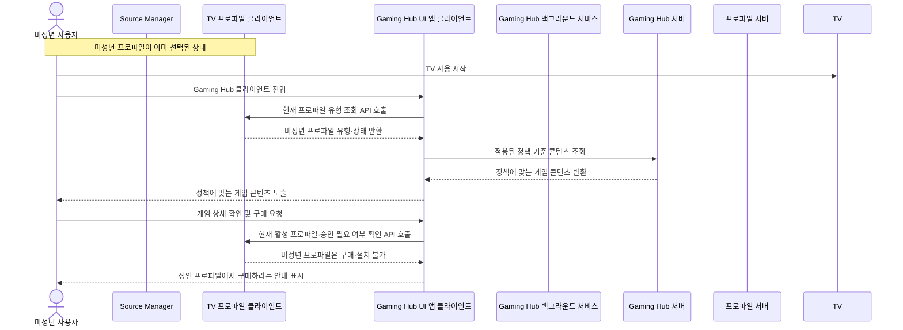
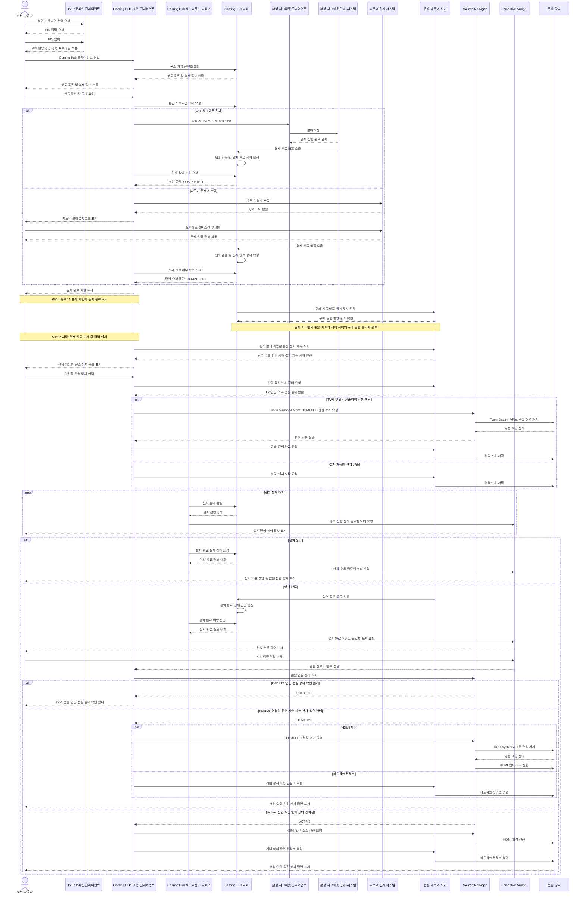
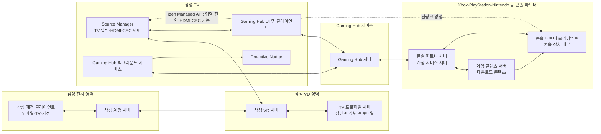
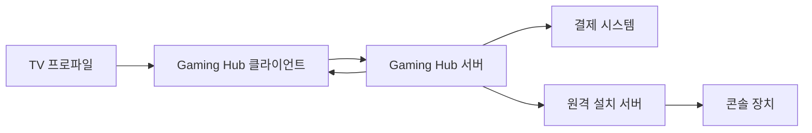
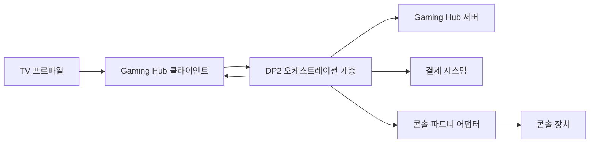

# Gaming Hub DP2 아키텍처 설계

> 상태: 초안 템플릿
>
> 목적: 삼성 계정과 TV 프로파일을 기반으로 콘솔 상품 구매부터 원격 설치, 설치 완료 알림, 콘솔 딥링크까지의 서비스 아키텍처를 설계하고 비교한다.

## 1. 배경

Gaming Hub는 Xbox, PlayStation, Nintendo 등 콘솔 파트너의 콘텐츠를 TV에서 탐색하고 이용할 수 있는 경험을 제공한다.

콘솔 파트너 콘텐츠의 기본 데이터 흐름과 콘텐츠 종류별 처리 방식은 Decision Point 1(DP1)에서 다룬 것으로 전제한다. 이 문서는 Decision Point 2(DP2)에 해당하는 사용자 프로파일 기반 구매·설치·실행 경험을 다룬다.

## 2. 목표

- 삼성 계정과 TV 프로파일을 구분해 사용자별 경험을 제공한다.
- 성인 및 미성년 프로파일의 권한과 구매 가능 범위를 반영한다.
- 콘솔 파트너 상품을 노출하고 결제 결과를 신뢰성 있게 확인한다.
- 사용자가 설치 대상 콘솔 장치를 선택할 수 있도록 한다.
- 선택한 콘솔의 연결 상태와 설치 가능 상태를 확인한다.
- 원격 설치를 시작하고 설치 상태 및 완료 결과를 Gaming Hub 클라이언트에 전달한다.
- 설치 완료 후 HDMI-CEC 및 네트워크 명령을 활용해 콘솔과 게임 상세 화면으로 이동한다.
- 사용자가 TV를 시청 중이거나 이미 콘솔을 사용 중인 경우에도 안전하게 상태를 안내한다.

## 3. 주요 개념

| 개념 | 설명 |
|---|---|
| 삼성 계정 | TV와 서비스의 상위 사용자 계정 |
| TV 프로파일 | 하나의 삼성 계정 안에서 개인화된 설정과 권한을 제공하는 사용자 단위 |
| 미성년 프로파일 | 별도 PIN 없이 선택할 수 있으며, 연령·보호자 정책에 따라 상품 노출·구매·설치가 제한되는 프로파일 |
| 성인 프로파일 | TV에 적용하기 전에 PIN 인증이 필요한 프로파일 |
| Gaming Hub UI 앱 클라이언트 | TV에서 콘텐츠를 탐색하고 구매·설치·실행 상태를 사용자에게 보여주는 화면 앱 |
| Gaming Hub 백그라운드 서비스 | 설치 완료 상태를 Gaming Hub 서버에 폴링하고 Proactive Nudge를 호출하는 백그라운드 구성요소 |
| 콘솔 파트너 | Xbox, PlayStation, Nintendo 등 콘텐츠와 원격 기능을 제공하는 외부 파트너 |
| 원격 설치 서버 | 사용자가 선택한 콘솔 장치에 설치 요청을 전달하고 상태를 추적하는 서버 |
| 딥링크 | 콘솔의 특정 게임 또는 실행 직전 상세 화면까지 이동시키는 기능 |

## 4. 핵심 사용자 흐름

1. 사용자가 TV 프로파일로 Gaming Hub에 진입한다.
2. 프로파일 권한과 지역·연령 조건에 따라 콘솔 상품을 조회한다.
3. 사용자가 상품을 선택하고 결제를 진행한다.
4. 결제 시스템의 결과를 Gaming Hub 서버가 검증하고 주문 상태를 확정한다.
5. 사용자가 설치 대상 콘솔 장치를 선택한다.
6. Gaming Hub 서버가 콘솔 연동 상태와 설치 가능 여부를 확인한다.
7. 원격 설치 서버에 설치 요청을 전달한다.
8. 설치 진행·성공·실패 상태를 추적한다.
9. 설치 완료 결과를 Gaming Hub 클라이언트에 전달한다.
10. 사용자의 현재 TV·HDMI·콘솔 상태에 따라 알림, 입력 전환, 딥링크를 수행한다.

### 4.1 사용자 시나리오 A: 미성년 프로파일의 구매·원격 설치 차단

1차 정책에서는 Netflix Kids와 Amazon Prime Video Kids와 같이 미성년 프로파일의 구매와 원격 설치를 허용하지 않는다. 미성년 사용자는 허용된 게임 콘텐츠를 탐색할 수 있지만, 결제와 설치를 진행하려면 성인 프로파일로 전환해야 한다.

1. 미성년 프로파일이 이미 선택된 상태에서 미성년 사용자가 TV 사용을 시작한다. 미성년 프로파일 선택에는 별도 PIN을 요구하지 않는다.
2. 사용자가 Gaming Hub 클라이언트에 진입한다.
3. Gaming Hub 클라이언트가 TV 프로파일 클라이언트가 제공하는 현재 프로파일 유형 조회 API를 호출한다.
4. TV 프로파일 클라이언트가 현재 프로파일이 미성년임을 반환한다.
5. Gaming Hub 클라이언트가 미성년 프로파일 정책을 적용하고 허용된 콘솔 게임 콘텐츠를 표시한다.
6. 사용자가 게임 상세 정보를 확인하고 구매를 시도한다.
7. Gaming Hub 클라이언트가 구매를 차단하고 “성인 프로파일에서 구매하세요” 안내를 표시한다.
8. 결제, 콘솔 장치 선택, 원격 설치, 딥링크 단계로는 진행하지 않는다.

### 4.2 사용자 시나리오 B: 성인 프로파일의 구매 및 원격 설치

성인 프로파일은 해당 지역과 계정 정책이 허용하는 범위에서 게임 콘텐츠를 탐색하고 구매한 뒤, 연결된 콘솔 장치에 원격 설치를 요청한다.

1. 성인 프로파일을 TV에 적용하려면 사용자가 PIN을 입력한다.
2. PIN 인증이 성공하면 성인 프로파일이 선택된 상태가 되고 사용자가 TV 사용을 시작한다.
3. 사용자가 Gaming Hub 클라이언트에 진입한다.
4. Gaming Hub 클라이언트가 성인 프로파일에 허용된 콘솔 게임 콘텐츠를 노출한다.
5. 사용자가 게임 상세 정보와 가격을 확인하고 구매를 요청한다.
6. Gaming Hub 서버가 결제 요청을 생성한다.
7. 결제 시스템이 결제를 처리하고 Gaming Hub 서버에 결제 완료 웹훅을 호출한다.
8. Gaming Hub 서버가 웹훅을 검증하고 최종 결제 완료 상태를 확정한다.
9. Gaming Hub 서버가 Gaming Hub 클라이언트에 최종 결제 완료 결과를 전달한다.
10. Gaming Hub 클라이언트가 성인 사용자에게 결제 완료 화면을 표시한다.
11. 결제 완료 표시가 끝난 뒤 Step 2 원격 설치를 시작한다.
12. 사용자가 설치할 콘솔 장치를 선택한다.
13. 파트너 서버가 콘솔 장치의 연결 상태와 설치 가능 여부를 확인한다.
14. 원격 설치 서버를 통해 선택한 콘솔에 설치를 요청한다.
15. 설치 상태와 완료 결과를 Gaming Hub 클라이언트에 전달한다.
16. 설치가 완료되면 사용자에게 알리고, 사용자의 현재 TV 상태에 따라 콘솔 입력 전환과 딥링크를 수행한다.

## 5. 기술적 어려움과 미결정 사항

- 삼성 계정, TV 프로파일, 파트너 계정, 콘솔 장치 식별자의 매핑 방식
- 미성년 프로파일의 상품 노출·결제·설치 권한 정책
- 삼성 Checkout과 파트너 스토어 결제 중 어떤 결제 주체를 선택할지
- 결제 성공을 검증하기 위한 서버 간 이벤트·콜백·조회 방식
- 중복 결제 및 중복 설치 요청을 방지하는 멱등성 처리
- 콘솔 장치가 해당 TV에 연결되어 있는지 판별하는 기준
- 콘솔이 꺼져 있거나 네트워크 연결이 끊긴 경우의 처리
- 파트너별 원격 설치 API와 상태 모델의 차이를 공통 모델로 추상화하는 방법
- HDMI-CEC 제어와 네트워크 명령의 책임 분리 및 실패 처리
- 사용자가 TV 시청 중이거나 콘솔을 이미 사용 중일 때의 입력 전환 정책
- 설치 완료 이벤트의 지연·중복·순서 뒤바뀜 처리
- 개인정보, 결제 정보, 미성년자 보호를 포함한 보안 및 감사 추적

## 6. DP2 통신 및 비동기 오케스트레이션 구조

DP2의 원격 설치는 사용자가 화면을 떠난 뒤에도 20~30분 이상 진행될 수 있는 장시간 작업이다. 따라서 Gaming Hub 서버가 설치 작업의 상태를 보관하고 조정하는 비동기 오케스트레이터 역할을 담당한다. 클라이언트가 설치 화면을 계속 유지하거나 설치 완료를 기다리며 동기 호출을 붙잡지 않는다.

### 6.1 모듈별 통신 방식

| 통신 경계 | 권장 방식 | 주요 용도 |
|---|---|---|
| Gaming Hub 서버 ↔ 콘솔 파트너 서버 | HTTPS REST API | 원격 설치 시작, 딥링크 요청, 작업 명령 |
| 콘솔 파트너 서버 → Gaming Hub 서버 | 서명된 HTTPS 웹훅 | 설치 시작·진행·완료·실패 이벤트 전달 |
| Gaming Hub 클라이언트 ↔ 콘솔 파트너 서버 | 파트너 공식 HTTPS API | 파트너 계정에 연결된 장치 목록 조회와 장치 선택 |
| Gaming Hub 클라이언트 ↔ Source Manager | Tizen Managed API | HDMI-CEC 전원 제어, 입력 소스 전환, 현재 연결 상태 확인 |
| Source Manager ↔ 콘솔 | Tizen System API | 플랫폼이 제공하는 콘솔 연동과 HDMI 입력 제어 |
| 콘솔 파트너 서버 ↔ 콘솔 클라이언트 | 파트너 네트워크 명령 | 원격 설치와 게임 상세 화면 딥링크 |

파트너 장치 정보는 파트너 서버에서 Gaming Hub 서버로 전달하지 않는다. Gaming Hub 클라이언트가 파트너 인증·API를 통해 장치 목록을 직접 조회하고, Gaming Hub 서버에는 장치 개인정보나 파트너 장치 식별자를 저장하지 않는 것을 기본 원칙으로 한다.

### 6.2 설치 작업 오케스트레이션

1. 결제가 최종 완료되면 Gaming Hub 서버가 설치 작업과 사용자의 자동 실행 의도를 저장한다.
2. Gaming Hub 클라이언트가 파트너 서버에서 원격 설치 가능한 장치 목록을 직접 조회한다.
3. 사용자가 장치를 선택하면 Gaming Hub 클라이언트가 파트너 서버에 설치 준비를 요청한다.
4. 파트너가 장치 상태를 반환하고, 선택한 장치가 현재 TV에 연결된 콘솔인지 확인한다.
5. 연결된 콘솔의 전원이 꺼져 있으면 Gaming Hub 클라이언트가 Tizen Managed API를 통해 Source Manager에 HDMI-CEC 전원 켜기를 요청한다.
6. Source Manager가 전원 켜짐 결과를 반환하고, Gaming Hub 클라이언트가 그 결과를 파트너 서버에 전달한다.
7. Gaming Hub 서버 또는 클라이언트가 파트너 서버에 원격 설치 시작을 요청한다.
8. 파트너 서버가 설치를 수행하고 Gaming Hub 서버의 웹훅으로 상태 이벤트를 전달한다.
9. Gaming Hub 서버가 이벤트를 검증하고 설치 상태를 갱신한다.
10. 설치 완료 시 Gaming Hub 서버가 설치 완료와 자동 실행 의도를 Gaming Hub 클라이언트에 전달한다. Gaming Hub 클라이언트가 Source Manager에 입력 전환을 요청하고, 파트너 서버에 딥링크를 요청한다.

### 6.3 설치 상태 모델

설치 작업은 서버에 다음과 같은 상태로 저장한다.

`INSTALL_REQUESTED → DEVICE_CHECKING → DEVICE_WAKEUP_REQUIRED → DEVICE_READY → INSTALLING → COMPLETED`

예외 상태는 다음과 같이 분리한다.

`DEVICE_UNAVAILABLE`, `WAKEUP_FAILED`, `INSTALL_FAILED`, `DEEPLINK_FAILED`, `EXPIRED`

결제 완료 상태와 설치 상태는 별도로 관리한다. 설치 실패는 자동 결제 환불을 의미하지 않으며, 환불은 별도의 결제·고객지원 정책 흐름으로 처리한다.

### 6.4 이벤트 및 보안 원칙

- 파트너 서버와 Gaming Hub 서버 사이의 명령은 HTTPS REST API로 전달한다.
- 파트너 서버가 보내는 설치 이벤트는 서명된 웹훅으로 받고, Gaming Hub 서버에서 서명을 검증한다.
- 설치 요청과 이벤트에는 작업 ID, 이벤트 ID, correlation ID를 사용한다.
- 동일한 웹훅이 여러 번 도착해도 한 번만 상태를 전이시키도록 멱등성을 보장한다.
- 웹훅은 빠르게 `2xx`로 수신 확인을 반환하고, 실제 상태 처리는 비동기로 수행한다.
- Gaming Hub 클라이언트가 화면에 보이지 않는 동안에도 서버가 설치 상태를 보존한다. Source Manager 호출은 Gaming Hub 클라이언트가 Tizen Managed API를 통해 수행한다.
- 설치 완료 후 자동 입력 전환과 딥링크는 사용자의 사전 선택 또는 동의를 전제로 한다.
- 장치 목록과 파트너 계정 정보는 Gaming Hub 서버에 저장하지 않고, 클라이언트와 파트너 사이에서 최소 범위로 처리한다.

## 7. 시스템 모듈 및 관계

다음 관계도는 DP2에서 고려하는 주요 모듈의 경계를 나타낸다. 삼성 계정은 모바일·TV·가전 등 전사 서비스에서 공유되는 계정이며, TV 프로파일은 Source Manager와 프로파일 서버 범위에서만 관리되는 별도 개념이다.

콘솔 파트너 서버는 파트너 계정·서비스 제어 영역과 실제 게임 콘텐츠 다운로드 영역으로 나누어 표현한다. 콘솔 파트너 클라이언트는 실제 콘솔 장치 내부에서 동작하는 소프트웨어다. 딥링크는 별도 모듈이 아니라 Gaming Hub UI 앱 클라이언트와 콘솔 파트너 클라이언트 사이에서 수행되는 기능이다.

## 8. 설계안

### 6.1 설계안 1: [제목 작성]

#### 개요

<!-- 설계안 1의 핵심 구조와 주요 책임을 작성한다. -->

#### Mermaid 다이어그램

#### 장점

- [작성]

#### 단점

- [작성]

#### 트레이드오프

- [작성]

### 6.2 설계안 2: [제목 작성]

#### 개요

<!-- 설계안 2의 핵심 구조와 주요 책임을 작성한다. -->

#### Mermaid 다이어그램

#### 장점

- [작성]

#### 단점

- [작성]

#### 트레이드오프

- [작성]

## 9. 시나리오 검토

| 시나리오 | 기대 동작 | 실패·예외 처리 | 관련 품질 속성 |
|---|---|---|---|
| 정상 구매 후 설치 | 결제 확인 후 장치 선택과 설치 진행 | - | [작성] |
| 미성년 프로파일 | 허용된 상품만 노출하고 정책에 따라 결제 제한 | 보호자 승인 또는 차단 | [작성] |
| 콘솔 미연결 | 설치 가능한 장치 목록에서 제외하거나 연결 안내 | 재시도·장치 등록 안내 | [작성] |
| 콘솔 오프라인 | 설치 요청을 보류하고 상태를 안내 | 온라인 전환 후 재개 | [작성] |
| 결제 성공·설치 실패 | 구매 상태와 설치 상태를 분리해 보존 | 재설치·지원 안내 | [작성] |
| 설치 완료·TV 시청 중 | 방해를 최소화한 알림 제공 | 사용자가 직접 실행 가능 | [작성] |
| 설치 완료·콘솔 사용 중 | 현재 세션을 확인한 뒤 전환 여부 결정 | 강제 전환하지 않음 | [작성] |
| 중복 이벤트 수신 | 동일 주문·설치 건을 한 번만 처리 | 멱등성 보장 | [작성] |

## 10. 품질 속성

DP2와 직접 연관된 품질 속성 세 가지를 선정하고, 각 설계안이 이를 얼마나 만족하는지 평가한다.

### 8.1 품질 속성 후보

1. **신뢰성**: 결제·설치·완료 상태가 유실되거나 잘못 연결되지 않고 일관되게 처리되는가
2. **보안 및 안전성**: 프로파일 권한, 미성년자 보호, 결제 및 장치 제어가 안전하게 동작하는가
3. **사용성 및 응답성**: 사용자가 현재 상태를 이해하고 불필요한 입력 전환이나 혼란 없이 게임을 실행할 수 있는가

### 8.2 품질 속성별 비교

| 품질 속성 | 설계안 1의 만족 방식 | 설계안 1의 한계 | 설계안 2의 만족 방식 | 설계안 2의 한계 | 트레이드오프 |
|---|---|---|---|---|---|
| 신뢰성 | [작성] | [작성] | [작성] | [작성] | [작성] |
| 보안 및 안전성 | [작성] | [작성] | [작성] | [작성] | [작성] |
| 사용성 및 응답성 | [작성] | [작성] | [작성] | [작성] | [작성] |

## 11. 종합 비교

| 구분 | 설계안 1: [제목] | 설계안 2: [제목] |
|---|---|---|
| 핵심 구조 | [작성] | [작성] |
| 장점 | [작성] | [작성] |
| 단점 | [작성] | [작성] |
| 운영 복잡도 | [작성] | [작성] |
| 파트너 확장성 | [작성] | [작성] |
| 프로파일·권한 대응 | [작성] | [작성] |
| 결제·설치 상태 신뢰성 | [작성] | [작성] |
| 주요 트레이드오프 | [작성] | [작성] |

## 12. 결론 및 선택

### 권장 설계안

<!-- 품질 속성 평가와 시나리오 검토 결과를 바탕으로 선택한다. -->

### 선택 근거

- [작성]

### 남은 결정 사항

- [작성]

## 13. 용어 및 참고

- DP: Decision Point
- HDMI-CEC: HDMI 연결 장치 간 제어 신호를 전달하는 표준
- 원격 설치: 네트워크를 통해 콘솔 장치에 게임 설치를 요청하는 기능
- 딥링크: 특정 게임 또는 콘솔 화면으로 직접 이동하는 기능
