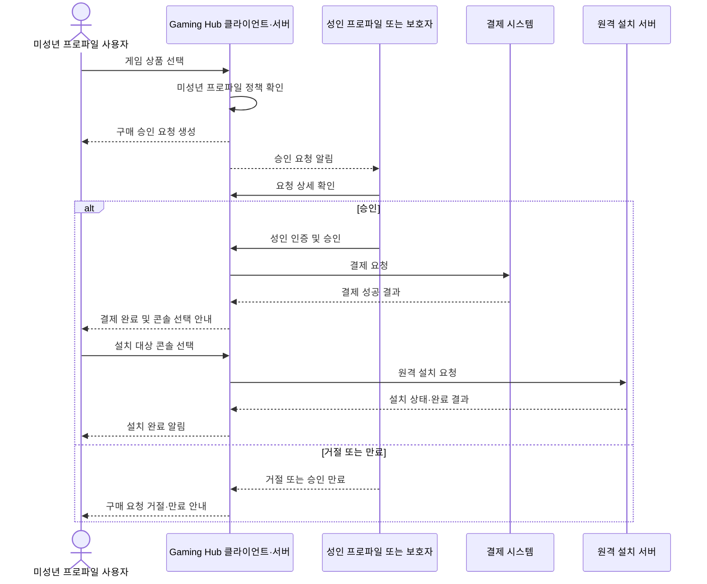
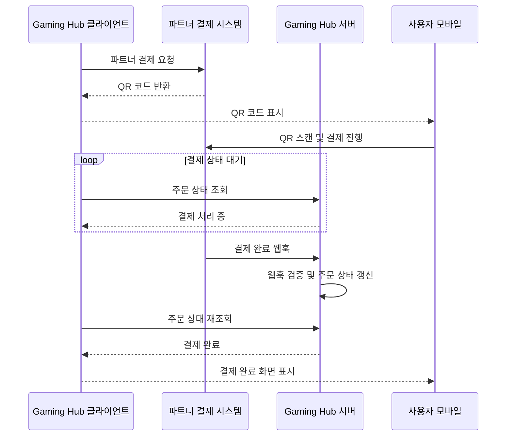

# 미성년 프로파일 구매 승인 방식 리서치

## 1. 조사 목적

OTT 및 디지털 콘텐츠 서비스가 미성년 사용자 프로파일의 콘텐츠 이용과 구매를 어떻게 제한하거나 부모의 승인을 받는지 조사한다. 조사 결과는 Gaming Hub DP2의 미성년 프로파일 구매·결제·원격 설치 시나리오 설계에 참고한다.

## 2. 서비스별 사례

### 2.1 Netflix: 프로파일 제한 및 콘텐츠 차단

Netflix는 Kids 프로파일과 프로파일별 시청 등급 제한을 제공한다. Kids 프로파일은 어린이에게 적합한 콘텐츠만 노출하고 계정 설정에 대한 직접 접근을 제한한다. Netflix의 대표적인 보호 방식은 구매 승인보다는 콘텐츠 노출 제한, 시청 등급 제한, 프로파일 잠금이다.

**설계 특징**

- 미성년 프로파일에 허용된 콘텐츠만 노출
- 계정 설정과 프로파일 관리 기능 제한
- 성인 프로파일 또는 계정 설정에 PIN 적용 가능
- 미성년 프로파일의 구매 승인형 흐름은 대표 기능으로 확인되지 않음

참고: [Netflix Parental Controls](https://help.netflix.com/en/node/53045), [Netflix Kids Profile](https://help.netflix.com/en/node/114275)

### 2.2 Amazon Prime Video: Kids 구매 차단과 성인 PIN

Amazon Prime Video는 Kids 프로파일에서 구매를 허용하지 않는다. 성인 프로파일에서의 구매를 보호하기 위해 구매 제한 기능과 Prime Video PIN을 사용할 수 있다. 또한 성인 프로파일을 PIN으로 잠가 미성년 사용자가 프로파일을 바꾸어 제한을 우회하지 못하도록 할 수 있다.

**설계 특징**

- Kids 프로파일에서는 구매 자체를 차단
- 구매 제한을 켜면 성인 프로파일에서도 PIN 필요
- 성인 프로파일 전환에 PIN 적용 가능
- 미성년자의 구매 요청을 부모가 승인하는 비동기 흐름보다는 사전 차단형에 가까움

참고: [Prime Video Kids Profiles](https://www.primevideo.com/-/hi/help?nodeId=GD6ARQYPV5H7RYA4)

### 2.3 Apple: Ask to Buy 승인 요청

Apple의 Ask to Buy는 자녀가 앱, 앱 내 구입 또는 다운로드를 요청하면 부모 또는 가족 대표에게 알림을 보내는 방식이다. 부모는 요청의 콘텐츠와 가격을 확인한 뒤 승인 또는 거절할 수 있다. 승인 시 부모 계정 인증을 거쳐 구매가 진행된다.

**설계 특징**

- 자녀의 요청과 부모의 결정을 분리
- 부모 기기에 실시간 알림 전달
- 부모가 승인 또는 거절
- 승인 이후 부모 인증과 결제 진행
- 요청 상태와 거래 기록을 확인할 수 있음

참고: [Apple Child Safety](https://www.apple.com/child-safety/), [Apple Ask to Buy Terms](https://www.apple.com/legal/internet-services/itunes/cg/terms-en.html)

### 2.4 Google Play: Purchase Requests

Google Play의 Purchase Requests는 자녀가 구매 요청을 보내면 가족 관리자가 자신의 기기에서 요청을 확인하고 승인 또는 거절하는 방식이다. 요청에는 상품 정보가 포함되며, 승인 시 가족 관리자의 결제 수단으로 구매할 수 있다.

**설계 특징**

- 자녀 프로파일에서 구매 요청 생성
- 가족 관리자에게 알림 전달
- 관리자가 요청 상품과 정보를 확인
- 승인 또는 거절 후 결과 전달
- 승인된 경우 가족 관리자의 결제 수단 사용 가능

참고: [Google Play Purchase Requests](https://blog.google/products-and-platforms/platforms/google-play/purchase-requests-google-play-families/)

## 3. 방식 비교

| 방식 | 대표 사례 | 미성년 사용자의 행동 | 성인의 행동 | Gaming Hub 적용 시 특징 |
|---|---|---|---|---|
| 차단형 | Netflix, Prime Video Kids | 콘텐츠 이용 또는 구매 시도 | 사전 정책 설정 | 구현이 단순하고 안전하지만 구매 경험이 제한됨 |
| PIN 인증형 | Prime Video 구매 제한 | TV에서 구매 시도 | PIN 입력 | 빠른 승인 가능하지만 TV를 함께 사용하는 상황에 의존 |
| 승인 요청형 | Apple Ask to Buy, Google Play | 구매 요청 생성 | 별도 기기에서 승인·거절 | 비동기 처리와 알림·상태 관리가 필요하지만 사용자 경험과 통제력이 좋음 |

## 4. Gaming Hub DP2 적용 제안

Gaming Hub에서는 미성년 프로파일의 구매 요청과 성인 프로파일 또는 보호자의 실제 결제를 분리하는 승인 요청형을 우선 검토한다.

### 권장 흐름

### 반드시 분리해야 하는 상태

승인 하나로 전체 작업이 완료된 것으로 처리하지 않고, 다음 상태를 별도로 관리해야 한다.

1. 구매 요청 생성
2. 승인 대기
3. 승인 또는 거절
4. 결제 처리 중
5. 결제 성공 또는 실패
6. 콘솔 장치 선택
7. 원격 설치 요청
8. 설치 진행 중
9. 설치 완료 또는 실패
10. 사용자 알림 및 딥링크 가능 상태

이렇게 분리하면 결제는 성공했지만 설치가 실패한 경우, 승인 후 결제가 취소된 경우, 알림이 늦게 도착한 경우를 각각 처리할 수 있다.

## 5. 설계 시사점

- 미성년 프로파일의 상품 노출과 구매 권한은 별도로 판정해야 한다.
- 보호자 승인자는 삼성 전사 계정과 TV 성인 프로파일의 관계를 명확히 정의해야 한다.
- 부모가 TV가 아닌 모바일 등 다른 기기에서 승인할 수 있는지 결정해야 한다.
- 승인 요청에는 상품명, 가격, 대상 콘솔, 설치 대상 장치, 요청 프로파일 정보를 포함해야 한다.
- 승인 요청은 중복 처리되지 않도록 요청 식별자와 만료 시간을 가져야 한다.
- 결제 성공 이벤트는 클라이언트 요청만 신뢰하지 말고 결제 시스템 서버 결과로 검증해야 한다.
- 설치는 결제와 별도의 비동기 작업으로 추적해야 한다.
- 보호자에게는 승인·거절·결제·설치 상태를 확인할 수 있는 기록을 제공하는 것이 바람직하다.

## 6. 결론

Netflix와 Prime Video는 미성년 프로파일에서 구매를 제한하거나 차단하는 방식에 가깝다. Apple과 Google은 미성년 사용자의 요청을 성인에게 전달하고, 성인이 별도 기기에서 승인하는 방식을 사용한다.

Gaming Hub DP2에서는 콘솔 게임 구매와 원격 설치가 연결되므로, 단순 PIN보다 승인 요청형을 중심으로 설계하는 것이 적합하다. 다만 서비스 초기에는 차단형을 기본값으로 제공하고, 파트너·지역·결제 정책이 준비된 경우 승인 요청형을 활성화하는 단계적 접근도 고려할 수 있다.

## 7. 결제 완료 시간과 웹훅 대기 정책 리서치

### 7.1 결제수단이 등록된 경우

Shopify Engineering이 공개한 Payment Request 실험에서는 브라우저나 결제수단에 카드가 이미 준비된 사용자의 결제 완료 시간이 데스크톱 중앙값 2분 16초, 모바일 중앙값 2분 35초였다. 이 자료는 “등록된 결제수단이면 항상 수초 안에 끝난다”는 의미는 아니지만, 일반적인 결제 완료 시간은 수십 초가 아니라 대체로 수분 단위로 설계해야 함을 보여준다.

참고: [Shopify Payment Request experiment](https://shopify.engineering/shaping-the-future-of-payments-in-the-browser)

### 7.2 결제수단이 등록되지 않은 경우

같은 실험에서 결제수단이 준비되지 않은 사용자의 결제 완료 시간은 데스크톱 중앙값 3분 13초, 모바일 중앙값 3분 22초였다. 90번째 백분위수는 데스크톱 7분 57초, 모바일 8분 08초까지 증가했다. 결제수단 입력과 인증이 추가되면 사용자 결제 화면을 수분 동안 유지할 수 있어야 한다.

추가로 PYMNTS의 결제 흐름 조사에서는 일반 체크아웃 시간이 조건에 따라 108~186초로 측정되었고, 저장·간소화된 Buy Button 흐름은 60~82초로 측정되었다. ([PYMNTS Buy Button Report](https://www.pymnts.com/wp-content/uploads/2022/08/PYMNTS-2022-Buy-Button-August-2022.pdf))

### 7.3 웹훅 대기와 사용자 결제 시간의 분리

결제 화면에서 사용자가 결제를 완료하는 시간과 웹훅 수신 API의 응답 제한 시간은 서로 다른 값이다.

- 사용자 결제 대기: 저장된 결제수단은 대략 1~3분, 미등록 결제수단은 대략 3~8분까지 고려한다.
- 웹훅 수신 API 응답: 결제 시스템이 웹훅을 재시도할 수 있도록 빠르게 `2xx`를 반환한다. PayPal은 수신 서버가 약 5~10초 안에 응답하도록 안내하고, Adyen은 실패한 웹훅을 30초부터 시작하는 간격으로 재시도한다. ([PayPal webhook best practices](https://developer.paypal.com/expanded/best-practices/), [Adyen webhook retry queue](https://docs.adyen.com/development-resources/webhooks/troubleshoot))
- 웹훅 미수신: 10초를 결제 실패로 판단하지 않는다. 파트너별 웹훅 SLA와 결제 세션 만료 정책을 기준으로 `처리 중` 상태를 유지한다.

### 7.4 DP2 적용안

#### 삼성 체크아웃 경로

삼성 체크아웃 클라이언트가 결제 화면과 결제 상태를 담당한다. Gaming Hub 서버는 삼성 체크아웃 서버의 결제 완료 웹훅을 받아 주문 상태를 갱신하고, TV의 Gaming Hub 클라이언트는 삼성 체크아웃 클라이언트가 제공하는 결과를 기준으로 화면을 전환한다.

#### 파트너 결제 경로

파트너 결제 시스템은 QR 코드로 사용자를 모바일 결제 화면으로 이동시킨다. 결제가 완료되면 파트너 결제 서버가 Gaming Hub 서버의 웹훅을 호출한다. TV의 Gaming Hub 클라이언트는 결제 시스템을 직접 확정하지 않고, Gaming Hub 서버의 주문 상태 API를 조회해 화면을 갱신한다.

TV 클라이언트의 상태 조회는 결제 확정 수단이 아니라 화면 갱신 수단이다. 결제 확정의 근거는 파트너 웹훅을 검증한 Gaming Hub 서버의 주문 상태로 한정한다.
